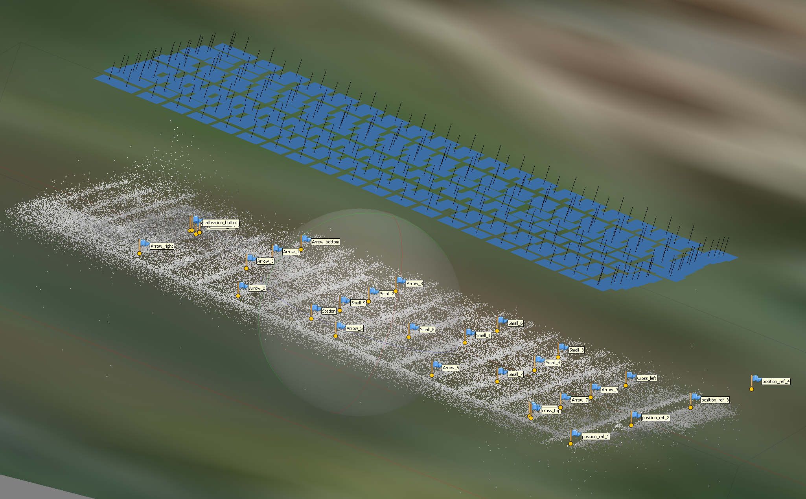
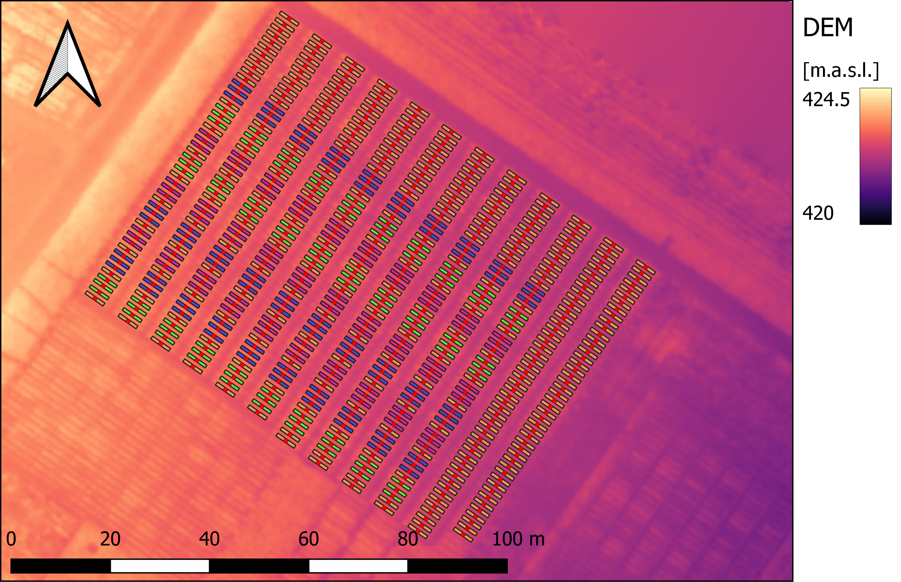

# Multi-view for thermography

This repository is a tutorial to use multi-view for analysis of drone-base thermal images. It contains a description of the process, example code and all example data required. It's suggested to work through this example and make it run on your computer before you try it on your own data.

## General introduction on multi-view

This protocol present a pipeline to use multi-view back projection for analyzing thermal images that were taken with a drone. Compared to analyzing thermal images on orthomosaics directly, this approach allows to include effects of measurement time and viewing geometry in the analysis as well as to improve spatial correction of the measurements. Same as for the orthomosaic analysis, images have to be aligned but the analysis is done on single images instead of orthomosaics by means back projection. Aligning the images is only done to orient the single images in space for analysis (georeferencing).
The approach can be used to analyse thermal images that were taken during a drone mapping campaign of an agricultural plot experiments.

## Tutorial

The numbered folders contain code and/or instruction on the respective step, the folders without numbering contain example data. Work through the code in the order indicated. Inside the folders, the different processing steps and files are described. 

In short:
1. Plot shape files are created in Python and and georeferenced in Qgis
1. Images are aligned in Agisoft Metashape
1. Shapes are projected on single images
1. From radiometric .jpg files, .tiff files are derived that represent temperature as [C°] * 1000 
1. Plot-wise temperature is extracted (plot-wise mean and all percentiles for all image-plot combinations)
1. Plot centroids are extracted for subsequent calculations of viewing geometries
1. Viewing geometries are calculated and timestamps extracted for each plot on each images, the final percentile for further data analysis is chosen at this step
1. Single output files are merged to a complete file for subsequent analysis, e.g. in R

Alle  data for this example is provided, also the results of single steps that provide the input of a subsequent step are provided.


*Example of aligned thermal images in an Agisoft project.*


*Example of a geojson shape file. Different colours indicate different experimental treatments. Centroids are in red. Background is a georeferenced DEM.*


### Code for spatial correction in R-Package SpATS

A basic code for spatial correction in SpATS to provide a starting point:

Load the SpATS package:
```R
library(SpATS)
```
Example of spats model for temporal/spatial correction:
```R
SpATS_fit_SpATS_aggreg <- SpATS(response = "Trait_of_Interest",
				random = ~ Xf + Yf + Plot_label + FlightDuratExposF +
				genotype:block_factor_names.treatment +
				block_factor_names.treatment:block_factor_names.replication,
				fixed = ~ block_factor_names.treatment,
				spatial = ~PSANOVA(X, Y, nseg = c(nX, nY), nest.div = c(1,1)),
				genotype = "genotype", genotype.as.random = TRUE, data = df_for_correction,
				weights = df_for_correction$weights,
				control = list(maxit = 100, tolerance = 1e-03, monitoring = 0))
```
